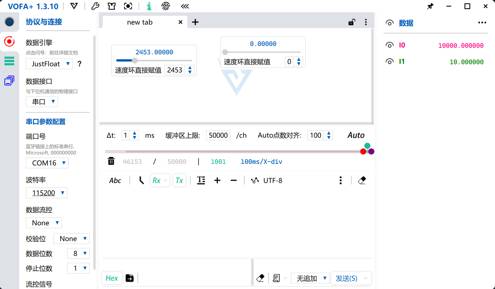
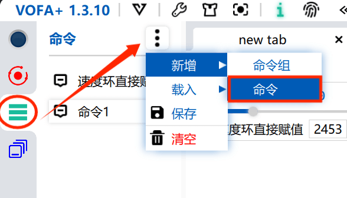
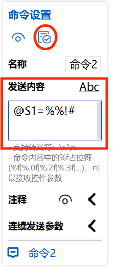
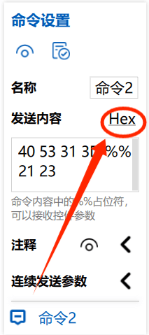
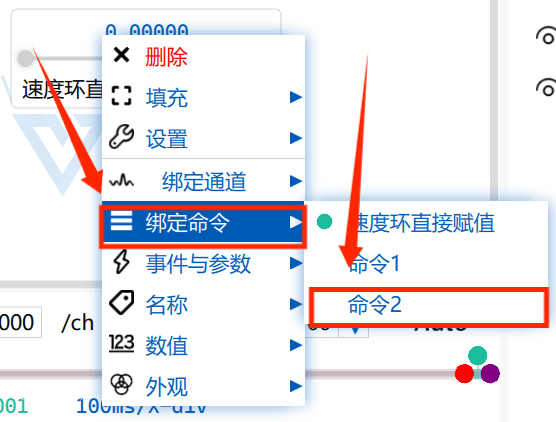

# 使用方法

> 写在前面: 作者是将两年前的代码修补了一下并开源出来，如果有问题可以issue，移植教程还是比较详细，仔细阅读下列教程基本上没什么问题。

---
- [使用方法](#使用方法)
	- [一、对外接口](#一对外接口)
		- [1.1 服务函数接口](#11-服务函数接口)
		- [1.2 命令解析服务相关接口](#12-命令解析服务相关接口)
	- [二、移植接口](#二移植接口)
	- [三、简单的使用样例](#三简单的使用样例)
		- [3.1 串口中断加入接收函数](#31-串口中断加入接收函数)
		- [3.2 定时判断接收标志位](#32-定时判断接收标志位)
	- [四、如何定制自己的命令帧？](#四如何定制自己的命令帧)
	- [五、数据大小端的切换](#五数据大小端的切换)
	- [六、VOFA命令的配置](#六vofa命令的配置)
		- [5.1 新建命令](#51-新建命令)
		- [5.2 根据你的命令帧编辑命令](#52-根据你的命令帧编辑命令)
		- [5.3 将命令绑定到控件](#53-将命令绑定到控件)

---


本仓库主要是用于串口调参的工具，使用`vofa`软件的`Justfloat`协议以及命令帧解析，可自定义响应帧。




## 一、对外接口

- **./inc/vofa_functions**

```C
void vofaSendJustFloat(vofaJustFloatFrame *vofaJFFrame);			//以JustFloat协议发送数据
void vofaSendFirewater(const float *fdata, const uint32_t ulSize);	//以Firewater协议发送数据
void vofaSendRawdata(uint8_t *pData, const uint32_t ulSize);		//以rawdata协议发送数据

void vofaJustFloatInit(void);										//Justfloat协议初始化
void uartCMDRecv(uint8_t byte_data);								//uart串口接收单字节并存入vofaCommandData数据包
void vofaCommandParse(void);										//解析命令

extern vofaJustFloatFrame JustFloat_Data;							//包含接收到的浮点数据的结构体
extern vofaCommand vofaCommandData;									//包含命令的结构体

```

### 1.1 服务函数接口

以下接口用于三种协议的数据发送

```C
/**
* @param vofaJFFframe: 包含数据帧的结构体
* @return void
*/
void vofaSendJustFloat(vofaJustFloatFrame *vofaJFFrame)
{
	uint8_t i;
	uint8_t u8Array[4];
	for (i = 0; i < CH_COUNT; i++)
	{
		float2uint8Array(u8Array, vofaJFFrame->fdata[i], 0);
		uartSendData(vofaJFFrame->u8Array, sizeof(u8Array));
	}
	uartSendData(vofaJFFrame->frametail, FRAME_TAIL_SIZE);
}

/**
* @param fdata: 指向要发送的浮点数据的指针
* @param ulSize： 要发送的数据个数
* @return void
*/
void vofaSendFirewater(const float *fdata, const uint32_t ulSize)
{
	uint32_t i;
	for (i = 0; i < ulSize - 1; i++)
	{
		printf("%.6f,", *(fdata + i));
	}
	printf("%.6f\n", *(fdata + i));
}

/**
* @param pData: 指向要发送的单字节数据的指针
* @param ulSize： 要发送的数据个数
* @return void
*/
void vofaSendRawdata(uint8_t *pData, const uint32_t ulSize)
{
	uint32_t i;
	for (i = 0; i < ulSize; i++)
	{
		uartSendByte(*(Data + i));
	}
}
```

### 1.2 命令解析服务相关接口

以下接口用于接收到的命令帧处理

```C
/**
* @breif 初始化JustFloat帧结构体
*/
void vofaJustFloatInit(void)
{
	vofaCommandData.cmdID                   = INVALID;
	vofaCommandData.cmdType                 = INVALID;
	vofaCommandData.completionFlag          = 0;
	JustFloat_Data.frametail[0] = 0x00;
	JustFloat_Data.frametail[1] = 0x00;
	JustFloat_Data.frametail[2] = 0x80;
	JustFloat_Data.frametail[3] = 0x7f;
}

/**
* @breif 将串口收到的数据判断并存入数据包中，并比对帧控制接收完成标志位置位
* @param byte_data： 串口接收到的字节数据 
*/
void uartCMDRecv(uint8_t byte_data) //此函数放在串口中断中
{
	vofaCommandData.uartRxPacket[vofaRxBufferIndex] = byte_data;

	if (vofaCommandData.uartRxPacket[vofaRxBufferIndex - 1] == '!' && vofaCommandData.uartRxPacket[vofaRxBufferIndex] == '#')
	{
		vofaCommandData.completionFlag = 1;
		vofaRxBufferIndex  = 0;
	}

	else if (vofaRxBufferIndex > (CMD_FRAME_SIZE - 1))
	{
		vofaCommandData.completionFlag = 0;
		vofaRxBufferIndex  = 0;
		memset(vofaCommandData.uartRxPacket, 0, 10);
	}

	else
	{
		vofaRxBufferIndex++;
	}
}

/**
*
*/
void vofaCommandParse(void)
{
	uint8_t* pRxPacket;
	pRxPacket = vofaCommandData.uartRxPacket;

	if (vofaCommandData.uartRxPacket[0] != '@' || vofaCommandData.uartRxPacket[3] != '=' || vofaCommandData.uartRxPacket[CMD_FRAME_SIZE - 2] != '!' || vofaCommandData.
		uartRxPacket[CMD_FRAME_SIZE - 1] != '#')
	{
		memset(vofaCommandData.uartRxPacket, 0, CMD_FRAME_SIZE);
		return;
	}

	switch (vofaCommandData.uartRxPacket[1])
	{
		case 'S': vofaCommandData.cmdType = Speed;
			break;
		case 'P': vofaCommandData.cmdType = Position;
			break;
		default: vofaCommandData.cmdType = INVALID;
			break;
	}

	switch (vofaCommandData.uartRxPacket[2])
	{
		case '1': vofaCommandData.cmdID = Direct_Assignment;
			break;
		case '2': vofaCommandData.cmdID = Increase;
			break;
		case '3': vofaCommandData.cmdID = Decrease;
			break;
		default: vofaCommandData.cmdID = INVALID;
			break;
	}
	memcpy(vofaCommandData.validData, pRxPacket + 4, 4);

	vofaCommandData.floatData = uint8Array2Float(vofaCommandData.validData, 0);

	pRxPacket = NULL;
	memset(vofaCommandData.validData, 0, 4);
	memset(vofaCommandData.uartRxPacket, 0, CMD_FRAME_SIZE);
}
```

## 二、移植接口

- **./src/vofa_uart.c**

  在移植时需要将以下串口发送单字节的函数中替换为相应的串口发送单字节的实现

```C
void uartSendByte(const uint8_t c)
{
	HAL_UART_Transmit(&huart1, (uint8_t*)&c, 1, HAL_MAX_DELAY); //修改为串口发送接口
}
```

- **./inc/vofa_function.h**

  ```C
  void uartCMDRecv(uint8_t byte_data);		//将此函数放在串口中断中
  ```

  

## 三、简单的使用样例

### 3.1 串口中断加入接收函数

```C
#include "vofa_function.h"

uint8_t rx_data = 0;

void USART1_RxCallBack(UsartTypedef *usart){
	if (usart->Instance == huart1){
        uartCMDRecv(rx_data);
        HAL_UART_Recieve_IT(&huart1, &rx_data, 1);
    }
}
```

### 3.2 定时判断接收标志位

```C## 
#include "vofa_function.h"

/*以主函数中的循环加延时检测为例*/
void main(void){
    /*
    *	一些初始化代码
    */
    for(;;){
		if (vofaCommandData.completionFlag == 1)		//收到命令帧
        	{	
            		vofaCommandData.completionFlag = 0; 			//清楚标志位
            		vofaCommandParse();						//解析收到的数据帧
            		/*
            		* 根据你的命令做相应处理
            		* vofaCommandData.cmdID是接收到的命令ID
            		* vofaCommandData.cmdType是接收到的命令类型
            		* vofaCommandData.floatData是接收到的浮点数据
            		*/
            
            		//使用举例
            		switch(vofaCommandData.cmdType) 		//判断收到的命令类型
            		{
                		case Speed:
                    			switch(vofaCommandData.cmdID)	//判断收到的命令ID
                    			{
                        			case Direct_Assignment:
                            			printf("I recv Command Type Speed, ID Direct_Assignment, data: %.6f", vofaCommandData.floatData);
                            			break;
                        			case Increse:
                            			printf("I recv Command Type Speed, ID Increse, data: %.6f", vofaCommandData.floatData);
                            			break;
                        			case Decrease:
                            			printf("I recv Command Type Speed, ID Decrease, data: %.6f", vofaCommandData.floatData);
                            			break;
                    			}
                    		break;
                		case Postion:
                    			switch(vofaCommandData.cmdID)	//判断收到的命令ID
                    			{
                        			case Direct_Assignment:
                            			printf("I recv Command Type Postion, ID Direct_Assignment, data: %.6f", vofaCommandData.floatData);
                            			break;
                        			case Increse:
                            			printf("I recv Command Type Postion, ID Increse, data: %.6f", vofaCommandData.floatData);
                            			break;
                        			case Decrease:
                            			printf("I recv Command Type Postion, ID Decrease, data: %.6f", vofaCommandData.floatData);
                            			break;
                    			}
                    		break;
            		}
        	}
        osDelay(50);		//延时50ms
	}
}

```

## 四、如何定制自己的命令帧？

- **./inc/vofa_function.h**

```C
#define CMD_FRAME_SIZE 10			//将此处更改为你需要的命令帧长度
```

**修改自己的命令类型和ID**

```C
//在此处枚举你需要的命令ID
enum CommandID
{
	Direct_Assignment,
	Increase,
	Decrease
};
//在此处枚举你需要的命令类型
enum CommandType
{
	Speed,
	Position
};
```

- **./src/vofa_function.c**

```C
void vofaCommandParse(void)
{
	uint8_t* pRxPacket;
	pRxPacket = vofaCommandData.uartRxPacket;

    //帧格式判断		此处的命令帧是以@+S/P+1/2/3+=四字节浮点数据+!+#为例
    //其中@是帧头 S/P对应命令类型 1/2/3对应命令ID !#为帧尾
	if (vofaCommandData.uartRxPacket[0] != '@' || vofaCommandData.uartRxPacket[3] != '=' || vofaCommandData.uartRxPacket[CMD_FRAME_SIZE - 2] != '!' || vofaCommandData.
		uartRxPacket[CMD_FRAME_SIZE - 1] != '#')
	{
		memset(vofaCommandData.uartRxPacket, 0, CMD_FRAME_SIZE);
		return;
	}

    //此处修改字节比对，改为你需要的类型
	switch (vofaCommandData.uartRxPacket[1])
	{
		case 'S': vofaCommandData.cmdType = Speed;
			break;
		case 'P': vofaCommandData.cmdType = Position;
			break;
		default: vofaCommandData.cmdType = INVALID;
			break;
	}
	//此处修改字节比对，改为你需要的ID
	switch (vofaCommandData.uartRxPacket[2])
	{
		case '1': vofaCommandData.cmdID = Direct_Assignment;
			break;
		case '2': vofaCommandData.cmdID = Increase;
			break;
		case '3': vofaCommandData.cmdID = Decrease;
			break;
		default: vofaCommandData.cmdID = INVALID;
			break;
	}
	memcpy(vofaCommandData.validData, pRxPacket + 4, 4);

	vofaCommandData.floatData = uint8Array2Float(vofaCommandData.validData, 0);

	pRxPacket = NULL;
	memset(vofaCommandData.validData, 0, 4);
	memset(vofaCommandData.uartRxPacket, 0, CMD_FRAME_SIZE);
}

```

## 五、数据大小端的切换

`JustFloat`处理浮点数是按照IEEE的标准，使用四个字节来标识float类型数据，那么这时候就存在一个问题，就是需要清楚数据在你的RAM或ROM中存储的方式是[大端存储(Big Endian)](https://baike.baidu.com/item/%E5%A4%A7%E7%AB%AF%E6%A0%BC%E5%BC%8F/6665553?fromModule=search-result_lemma)还是[小端存储(Little Endian)](https://baike.baidu.com/item/%E5%B0%8F%E7%AB%AF%E5%AD%98%E5%82%A8/3432023)，以便转换函数按照正确的格式转换你的数据。

```C
//使用小端(Little-endian)的架构：
//最常用x86架构(包括x86_64)，还有 6502 (including 65802, 65C816), ARM Cortex, Z80 (including Z180, eZ80 etc.), MCS-48, 8051, DEC Alpha, Altera Nios, Atmel AVR, SuperH, VAX, 和 PDP-11 等等；

//使用大端(Big-endian)的架构：
// Motorola 6800 and 68k, Xilinx Microblaze, IBM POWER, system/360, System/370 等等。

//支持配置endian的架构：
//如下架构有配置endian为大端、小端中任一种的功能， ARM, PowerPC, Alpha, SPARC V9, MIPS, PA-RISC 和 IA-64 等等。
```

需要在 `base_tranfer.h`中通过宏定义进行配置:

```C
#ifndef BASE_TRANSFER_H__
#define BASE_TRANSFER_H__

#define USE_BIG_ENDIAN		0		//启用大端存储格式
#define USE_LITTLE_ENDIAN	1		//启用小端存储格式

#include <stdint.h>
#include <string.h>

float uint8Array2Float(const uint8_t* u8Array);
void float2uint8Array(uint8_t* u8Array, const float* fdata);

#endif
```

样例代码由于是在`STM32`上测试的，是`ARM Cortex`架构，故将`#define USE_LITTLE_ENDIAN`配置为了`1`，以启用小端存储格式解析。

## 六、VOFA命令的配置

### 5.1 新建命令



### 5.2 根据你的命令帧编辑命令



注意编辑完成后一定要切换为HEX模式保存



### 5.3 将命令绑定到控件

在控件上右键单击，选择`绑定命令`，选择我们刚刚保存的命令即可完成绑定


